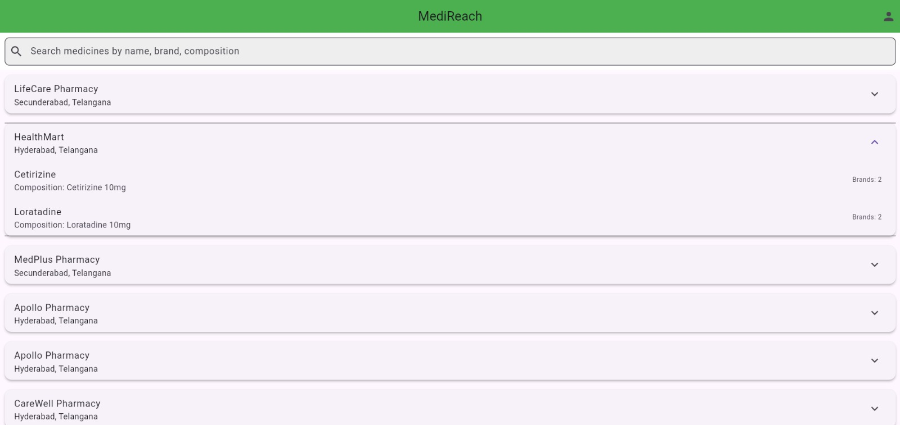
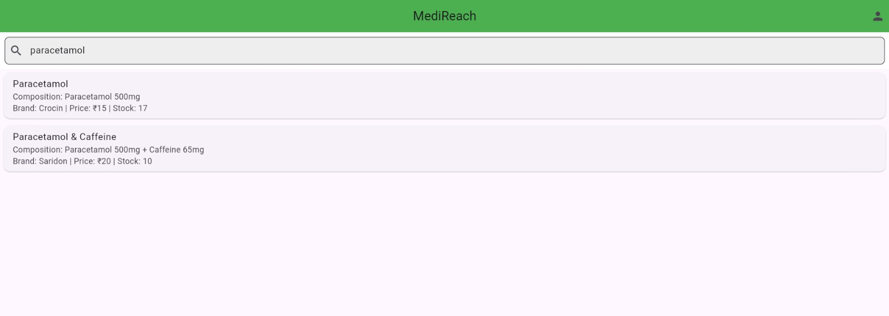
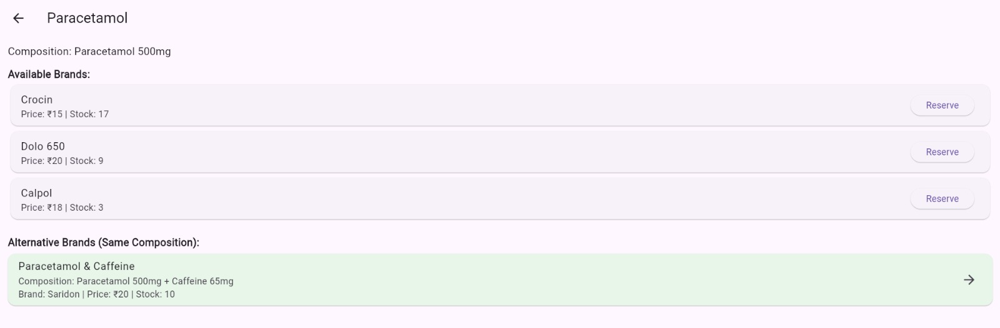
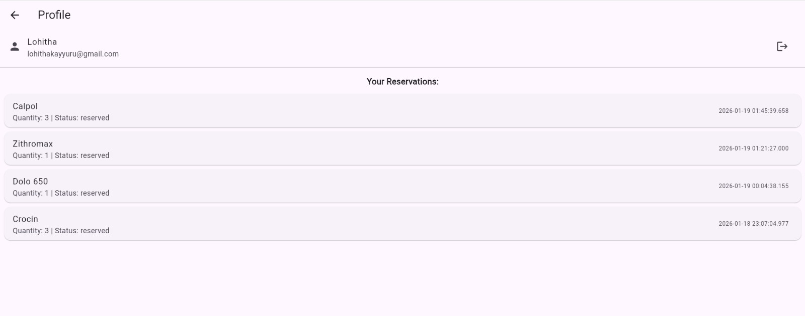

# MediReach

**MediReach** is a Flutter-based web application that helps users find medicines in nearby pharmacies in real time, view alternative brands using AI-powered recommendations, and reserve medicines for later pickup. The app integrates Firebase for authentication, database storage, and push notifications, providing a seamless and secure experience for users.

---

## Features

### Location-Based Medicine Search
- Detects user's current location to show nearby pharmacies.
- Real-time stock availability for each medicine at different pharmacies.

### Medicine Details & AI Recommendations
- View detailed medicine information including composition, available brands, and stock.
- AI-powered suggestions for alternative medicines with the same composition.

### User Reservations
- Reserve medicines directly from the app.
- Manage your reservations in your profile.
- Reservations require user login via Firebase Authentication.

### Watchlist & Notifications
- Add medicines to your watchlist.
- Receive notifications for low-stock medicines.

### Secure & Scalable
- Uses Firebase Firestore for real-time database updates.
- Authentication and reservations are secured with Firebase Auth.
- Push notifications via Firebase Cloud Messaging.

---

## Screenshots






---

## Tech Stack

- **Frontend:** Flutter, Dart
- **Backend & Database:** Firebase Firestore
- **Authentication:** Firebase Auth
- **Notifications:** Firebase Cloud Messaging
- **AI Recommendation Service:** Custom AI Service (simulated or integrated)
- **State Management:** setState (Flutter native)

---

## Database Structure (Firestore)

### **medicines**
```json
{
  "name": "Paracetamol",
  "composition": "Paracetamol 500mg",
  "pharmacyId": "sX4PbY4QfvGhinGUNekP",
  "brands": [
    { "brandName": "Crocin", "price": 15, "stock": 17 },
    { "brandName": "Dolo 650", "price": 20, "stock": 9 }
  ]
}
```
### **pharmacies**
```json
{
  "name": "Apollo Pharmacy",
  "address": "Hyderabad, Telangana",
  "location": { "lat": 13.65, "lng": 79.427 }
}
```
### **reservations**
```json
{
  "medicineId": "Azithromycin",
  "brandName": "Zithromax",
  "pharmacyId": "sX4PbY4QfvGhinGUNekP",
  "quantity": 1,
  "status": "reserved",
  "timestamp": "2026-01-19T01:21:27+05:30",
  "userId": "hAYrPm8jZ3a3NqPwqljtYIdszlg1"
}
```
### **users**
```json
{
  "name": "Lohitha",
  "email": "user1@gmail.com",
  "address": "123 Street, City",
  "number": "9999999999"
}
```

---

Installation
------------

1.  **Clone the repository**
```bash
git clone https://github.com//MediReach.git
cd MediReach   
```

2.  **Install Flutter dependencies**
```bash
flutter pub get
```

3.  **Set up Firebase**
    

*   Create a Firebase project.
    
*   Add google-services.json (Android) and GoogleService-Info.plist (iOS).
    
*   Ensure Firestore and Firebase Auth are enabled.
    

4.  **Run the app**
```bash
flutter run
```

Usage
-----

1.  Launch the app.
    
2.  Allow location access to view nearby pharmacies.
    
3.  Search medicines by name, brand, or composition.
    
4.  View medicine details, stock, and alternative brands.
    
5.  Reserve medicines (login required).
    
6.  View and manage reservations in the profile.
    
7.  Add medicines to watchlist to get stock notifications.
   

Future Enhancements
-------------------

*   **Integration with payment gateways** for online reservation payments.
    
*   **Chatbot assistance** for medicine recommendations.
    
*   **Advanced AI-based stock prediction** for nearby pharmacies.
    
*   **Dark mode and theming** for enhanced UI/UX.
    
Author
------

**Lohitha Kayyuru**
